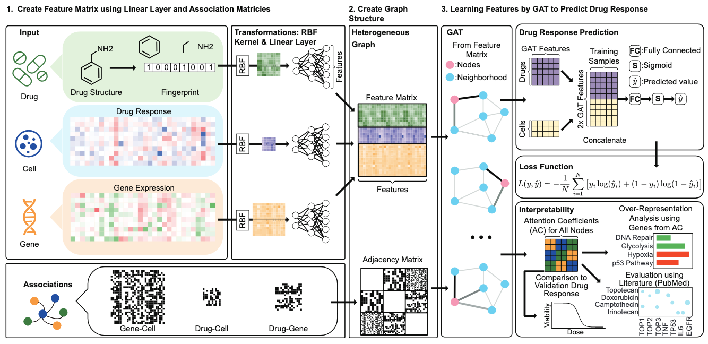

# drGAT

[](https://arxiv.org/abs/2405.08979)



This is the official implementation for **drGAT: Attention-Guided Gene Assessment for Drug Response in Drug-Cell-Gene Heterogeneous Network**.  

This model is created to understand how genes influence Drug Response using Graph Attention Networks (GAT) on heterogeneous networks of drugs, cells, and genes. It predicts Drug Response based on the attention coefficients generated during this process. This has been implemented in Python.

## Quick start

This quick start guide demonstrates how to run drGAT predictions on both CPU and GPU, completing the process within seconds.

```shell
git clone git@github.com:inoue0426/drGAT.git
cd drGAT
docker pull inoue0426/drgat
docker run -it -p 9999:9999 inoue0426/drgat
```

Then access to http://localhost:9999/notebooks/Tutorial.ipynb and run all cells.

\* This might be required you to increase the memory usage on docker.
If so, please follow this:
1. Open Docker Desktop Dashboard
2. Click on the Settings icon
3. Navigate to Resources > Advanced
4. Adjust the Memory slider to increase the limit
5. Click "Apply & Restart" to save changes

## Input Data

The model takes the following data structure:

```python
data = [
    drug,          # Drug similarity matrix
    cell,          # Cell line similarity matrix
    gene,          # Gene similarity matrix
    edge_index,    # Graph edge indices
    train_drug,    # Training set drug indices
    train_cell,    # Training set cell line indices
    val_drug,      # Validation set drug indices
    val_cell,      # Validation set cell line indices
    train_labels,  # Training set binary labels
    val_labels     # Validation set binary labels
]
```

Output is as follows:

| Accuracy | Precision | Recall | F1 Score | True Positive | True Negative | False Positive | False Negative |
|-----------|-----------|---------|-----------|----------------|---------------|----------------|-----------------|
| 0.771375 | 0.740881 | 0.783245 | 0.761474 | 1178 | 1312 | 412 | 326 |

\* You can change the output to the probability or binary prediction easily.


## Training

For re-training the model, refer to model_training.ipynb. If you want to use your dataset, create_dataset.ipynb might be useful.


## Requirement

```
numpy==1.23.5
pandas==2.0.3
matplotlib==3.7.1
optuna==3.2.0
torch==1.13.1+cu116
torch-cluster==1.6.1+pt113cu116
torch-geometric==2.3.1
torch-scatter==2.1.1+pt113cu116
torch-sparse==0.6.17+pt113cu116
torch-spline-conv==1.2.2+pt113cu116
```

** NOTE: Please ensure the version matches exactly with your GPU/CPU specifications.

## Environment

Our experiment was conducted on Ubuntu with an NVIDIA A100 Tensor Core GPU.  
If you want to re-train model, we recommend using GPU.

---

## Installation using Conda

```shell
git clone git@github.com:inoue0426/drGAT.git
cd drGAT
conda env create -f environment.yml
conda activate drGAT
python -m ipykernel install --user --name=drGAT
jupyter notebook --port=9999
```

Then access to http://localhost:9999/notebooks/Tutorial.ipynb 

## Installation using requirement.txt

```shell
git clone git@github.com:inoue0426/drGAT.git
cd drGAT
conda create --name drGAT python=3.10 -y
conda activate drGAT
pip install -r requirement.txt
# Please make sure to change the version to match the version of your GPU/CPU machine exactly.
pip install --no-cache-dir  torch==1.13.1+cu116 --extra-index-url https://download.pytorch.org/whl/cu116
pip install --no-cache-dir torch_geometric
pip install --no-cache-dir pyg_lib torch_scatter torch_sparse torch_cluster torch_spline_conv -f https://data.pyg.org/whl/torch-1.13.1%2Bcu116.html
python -m ipykernel install --user --name=drGAT
jupyter notebook --port=9999
```
** NOTE: Please ensure the version matches exactly with your GPU/CPU specifications.

## Data

Data for this project came from [CellMinerCDB](https://pubmed.ncbi.nlm.nih.gov/30553813/) and is in the [data direcotry](https://github.com/inoue0426/drGAT/tree/main/data) as well as the preprocessing code [here](https://github.com/inoue0426/drGAT/tree/main/preprocess).

## Citation 

```
@article{inoue2024drgat,
  title={drGAT: Attention-Guided Gene Assessment of Drug Response Utilizing a Drug-Cell-Gene Heterogeneous Network},
  author={Inoue, Yoshitaka and Lee, Hunmin and Fu, Tianfan and Luna, Augustin},
  journal={ArXiv},
  year={2024},
  publisher={arXiv}
}
```
